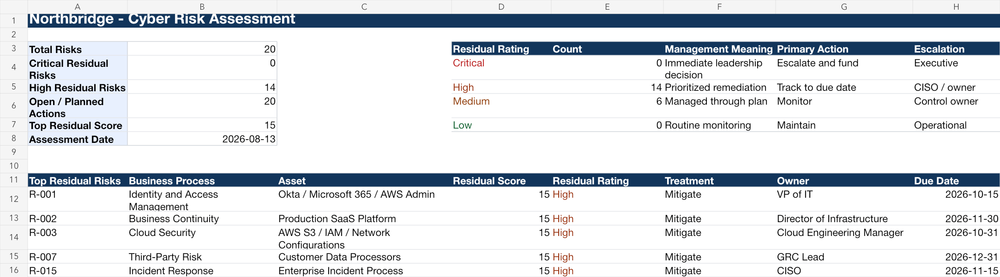

# Northbridge Program, Phase 1: Enterprise Cybersecurity Risk Assessment

## Purpose

This project demonstrates how a GRC analyst can build a practical cybersecurity risk assessment for a cloud SaaS company. It includes risk identification, inherent risk scoring, existing control evaluation, residual risk scoring, risk treatment, ownership, target dates, and executive reporting.

## Scenario

Northbridge Cloudworks has never completed a formal enterprise cybersecurity risk assessment. Leadership wants a risk register that can support security planning, budget prioritization, SOC 2 readiness, and executive risk discussions.

## Dashboard Preview

## Standards Used

- NIST SP 800-30 Rev. 1 for risk-assessment concepts.
- NIST IR 8286 Rev. 1, 8286A Rev. 1, and 8286C Rev. 1 for integrating cybersecurity risk into enterprise risk management.
- NIST SP 1308 for connecting CSF 2.0, enterprise risk, and workforce planning.
- NIST CSF 2.0 for functional alignment.
- NIST SP 800-53 Rev. 5 Release 5.2.0 and NIST SP 800-53A Rev. 5 for control and testing references.
- CIS Controls v8.1, ISO/IEC 27001:2022/Amd 1:2024, ISO/IEC 27002:2022, and AICPA TSC revised points of focus 2022 for portfolio-level control language.

## Deliverables

- `Northbridge-Enterprise-Risk-Assessment.xlsx`
- [Risk Methodology and Executive Summary](Northbridge-Risk-Methodology-and-Executive-Summary.md)

## What This Proves

This project shows that you can:

- Convert business and technology conditions into risk statements.
- Distinguish inherent risk from residual risk.
- Evaluate whether existing controls reduce risk enough.
- Recommend realistic risk treatment actions.
- Assign accountable owners and due dates.
- Explain risk in business terms instead of only technical terms.

## Files

| Artifact | Browse | Working file |
|---|---|---|
| Northbridge Enterprise Risk Assessment | [PDF](pdf/Northbridge-Enterprise-Risk-Assessment.pdf) | [xlsx](artifacts/Northbridge-Enterprise-Risk-Assessment.xlsx) |
