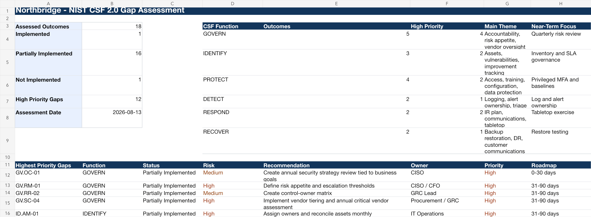

# Project 2 - NIST CSF 2.0 Gap Assessment

## Purpose

This project demonstrates how a GRC analyst can assess a company's cybersecurity program against NIST CSF 2.0, compare current and target states, identify gaps, prioritize remediation, and communicate results to leadership.

## Scenario

Northbridge Cloudworks completed an enterprise cybersecurity risk assessment and now wants to understand how its current cybersecurity program aligns to NIST CSF 2.0. Leadership wants a practical roadmap, not a fake certification score.

## Dashboard Preview

## Standards Used

- NIST CSF 2.0 as the primary framework.
- NIST SP 1308 for governance, enterprise-risk, and workforce alignment.
- NIST IR 8286 Rev. 1 series for enterprise-risk reporting context.
- NIST SP 800-53 Rev. 5 Release 5.2.0 and NIST SP 800-53A Rev. 5 for control and assessment references.
- CIS Controls v8.1, ISO/IEC 27001:2022/Amd 1:2024, ISO/IEC 27002:2022, AICPA TSC revised points of focus 2022, and ISO/IEC 27017:2026 where control-language alignment is useful.
- NIST SP 800-61 Rev. 3 where incident response is relevant.

## Deliverables

- `Northbridge-NIST-CSF-2.0-Gap-Assessment.xlsx`
- [CSF 2.0 Gap Assessment Report](Northbridge-CSF-2.0-Gap-Assessment-Report.md)

## What This Proves

This project shows that you can:

- Interpret NIST CSF 2.0 outcomes in a realistic business context.
- Build current and target profiles.
- Identify implementation gaps.
- Avoid claiming NIST CSF "certification."
- Prioritize remediation by risk, business impact, and effort.
- Translate assessment results into a 12-month roadmap.

## Suggested Interview Positioning

> I built a NIST CSF 2.0 current-versus-target gap assessment for the same fictional SaaS company used in my risk assessment project. I assessed outcomes across GOVERN, IDENTIFY, PROTECT, DETECT, RESPOND, and RECOVER, documented evidence and gaps, assigned owners, and built a remediation roadmap with 0-30, 31-90, 3-6 month, and 6-12 month actions.

## Files

| Artifact | Browse | Working file |
|---|---|---|
| Northbridge NIST CSF 2.0 Gap Assessment | [PDF](pdf/Northbridge-NIST-CSF-2.0-Gap-Assessment.pdf) | [xlsx](artifacts/Northbridge-NIST-CSF-2.0-Gap-Assessment.xlsx) |
