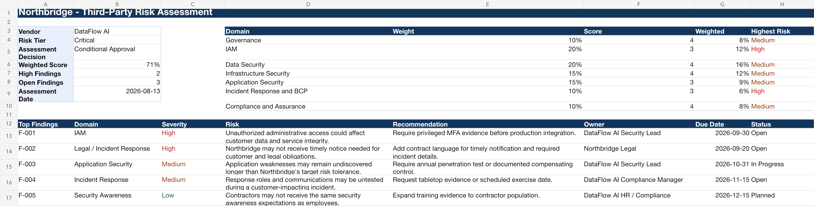

# Northbridge Program, Phase 3: Third-Party Risk Management Assessment

## Purpose

I built this project to evaluate a prospective vendor: reviewing security evidence, identifying risks, tracking remediation, and making a documented approval recommendation.

## Scenario

Northbridge Cloudworks wants to onboard a fictional SaaS vendor, DataFlow AI, to enrich customer-support analytics. DataFlow AI would process confidential customer business data and integrate with Northbridge's production application and Salesforce environment.

Because the vendor will process customer data and connect to production workflows, Northbridge classifies DataFlow AI as a critical third party requiring security review before approval.

## The judgment call

DataFlow AI's two high-severity findings, incomplete privileged-MFA evidence and vague breach-notification terms, were enough that I wasn't comfortable with an unconditional approval. But they weren't disqualifying either: the underlying security foundation was reasonable, and both gaps are things a vendor can fix on a timeline. I recommended conditional approval with four named preconditions instead of a rejection. A more risk-averse analyst could reasonably have rejected the vendor outright until every finding closed, given the AI system's access to confidential customer data, and that call would have cost Northbridge a service leadership already wanted.

## Dashboard Preview

## Standards Used

- NIST SP 800-161 Rev. 1 Update 1 for cyber supply-chain risk management.
- NIST CSF 2.0 for governance, supply-chain, protection, detection, response, and recovery alignment.
- NIST IR 8286 Rev. 1 series for enterprise-risk escalation and reporting.
- NIST SP 800-53 Rev. 5 Release 5.2.0 for control references.
- NIST SP 800-53A Rev. 5 for evidence and control-assessment logic.
- CIS Controls v8.1 for practical safeguard mapping.
- ISO/IEC 27001:2022/Amd 1:2024 and ISO/IEC 27002:2022 for ISMS and control-language alignment.
- ISO/IEC 27017:2026 for cloud-service security considerations.
- AICPA Trust Services Criteria with revised points of focus 2022 for SOC 2 evidence review.
- NIST SP 800-61 Rev. 3 for incident-response evidence and breach-notification considerations.

## Deliverables

- `Northbridge-Third-Party-Risk-Assessment.xlsx`
- [Vendor Risk Assessment Report](Northbridge-DataFlow-AI-Vendor-Risk-Assessment-Report.md)

## Scope and approach

In this phase, I:

- Classified a vendor by inherent risk.
- Built and scored a vendor security questionnaire.
- Reviewed simulated SOC 2, penetration-test, policy, incident-response, and business-continuity evidence.
- Distinguished vendor control gaps from contract gaps.
- Recommended approval, conditional approval, rejection, or risk acceptance.
- Tracked remediation actions to closure.
- Explained third-party risk decisions in business terms.

## Files

| Artifact | Browse | Working file |
|---|---|---|
| Northbridge Third Party Risk Assessment | [PDF](pdf/Northbridge-Third-Party-Risk-Assessment.pdf) | [xlsx](artifacts/Northbridge-Third-Party-Risk-Assessment.xlsx) |
