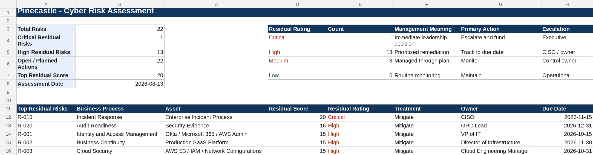

# Project 4 (Pinecastle Phase 1): Enterprise Cybersecurity Risk Assessment

> **Fictional organization. Created for portfolio demonstration purposes.**

## Purpose

A cybersecurity risk assessment for a cloud SaaS company: risk identification, inherent scoring, evaluation of existing controls, residual scoring, treatment, owners, target dates, and executive reporting.

## Scenario

Pinecastle Software has never completed a formal enterprise cybersecurity risk assessment. Leadership wants a register it can use for security planning, budget prioritization, SOC 2 readiness, and executive risk discussions.

## The judgment call

Untested incident response (R-015) has the highest residual score of the 22 risks, at 20. A register read strictly by score would treat it as a single gap to close with a tabletop. I led the executive summary with governance instead, because R-015, R-020, and several of the High risks share a cause: controls with no owner, no review cadence, and no retained evidence. Another analyst could reasonably have kept strict score order and written each risk up separately. My bet is that fixing ownership and evidence removes more residual risk per hour of effort than fixing any one control on its own.

Two risks were added late in the assessment. R-021 covers the chance that a billing-page change brings card data into Pinecastle systems and breaks the Stripe-hosted design. R-022 covers the separate sign-in policies in Okta and Entra ID. Both score Medium residual, and neither has started.

## Dashboard preview

## Standards used

- NIST SP 800-30 Rev. 1 for risk-assessment concepts.
- NIST IR 8286 Rev. 1, 8286A Rev. 1, and 8286C Rev. 1 for integrating cybersecurity risk into enterprise risk management.
- NIST SP 1308 for connecting CSF 2.0, enterprise risk, and workforce planning.
- NIST CSF 2.0 for functional alignment.
- NIST SP 800-53 Rev. 5 Release 5.2.0 and NIST SP 800-53A Rev. 5 for control and testing references.
- CIS Controls v8.1, ISO/IEC 27001:2022/Amd 1:2024, ISO/IEC 27002:2022, AICPA TSC (revised points of focus 2022), and PCI DSS v4.0.1 for control language.

## Approach

- Wrote each risk as a business-process risk statement, not a vulnerability.
- Scored inherent and residual risk separately, and credited no reduction for the two control sets rated Ineffective.
- Recommended treatments, owners, and due dates for each risk.
- Wrote the executive summary in business terms.

## Files

| Artifact | Browse | Working file |
|---|---|---|
| Pinecastle Enterprise Risk Assessment | [PDF](pdf/Pinecastle-Enterprise-Risk-Assessment.pdf) | [xlsx](artifacts/Pinecastle-Enterprise-Risk-Assessment.xlsx) |
| [Risk Methodology and Executive Summary](Pinecastle-Risk-Methodology-and-Executive-Summary.md) | | |
