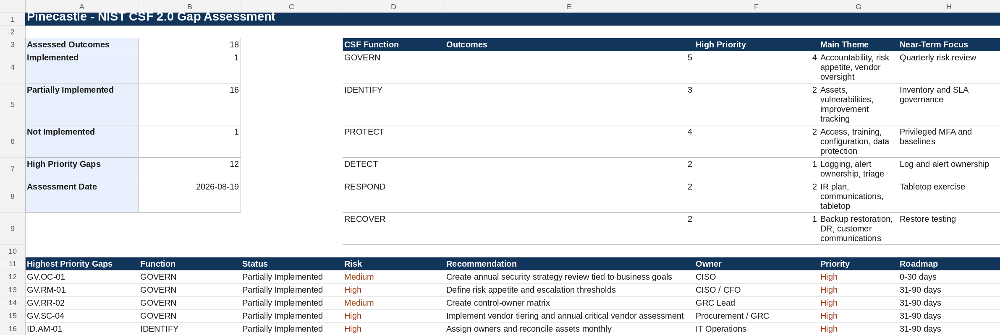

# Project 5 (Pinecastle Phase 2): NIST CSF 2.0 Gap Assessment

> **Fictional organization. Created for portfolio demonstration purposes.**

## Purpose

An assessment of Pinecastle's program against 18 NIST CSF 2.0 outcomes: current and target states, gaps, remediation priorities, and a roadmap for leadership.

## Scenario

Pinecastle Software completed an enterprise cybersecurity risk assessment and now wants to understand how its current cybersecurity program aligns to NIST CSF 2.0. Leadership wants a roadmap it can fund. CSF has no certification, so the assessment does not produce a score that implies one.

## The judgment call

Phase 1 scored ransomware disruption at 15, one of four risks tied just below the top two, driven partly by untested backups. I still put the full disaster-recovery exercise in the 6-12 month window, behind governance owners, a risk tracker, and vendor tiering. A DR test run before anyone owns the results produces another undocumented finding. A different analyst weighting the risk score more heavily than the ownership gap could reasonably have pulled the DR exercise into the first 90 days and treated the accountability gap as a problem to solve afterward.

## Dashboard preview

## Standards used

- NIST CSF 2.0 as the primary framework.
- NIST SP 1308 for governance, enterprise-risk, and workforce alignment.
- NIST IR 8286 Rev. 1 series for enterprise-risk reporting context.
- NIST SP 800-53 Rev. 5 Release 5.2.0 and NIST SP 800-53A Rev. 5 for control and assessment references.
- CIS Controls v8.1, ISO/IEC 27001:2022/Amd 1:2024, ISO/IEC 27002:2022, AICPA TSC revised points of focus 2022, and ISO/IEC 27017:2026 where control-language alignment is useful.
- NIST SP 800-61 Rev. 3 where incident response is relevant.

## Deliverables

- `Pinecastle-NIST-CSF-2.0-Gap-Assessment.xlsx`
- [CSF 2.0 Gap Assessment Report](Pinecastle-CSF-2.0-Gap-Assessment-Report.md)

## Approach

- Scored 18 outcomes across all six Functions: 1 Implemented, 16 Partially Implemented, 1 Not Implemented.
- Built current and target profiles and prioritized gaps by risk, business impact, and effort.
- Sequenced the roadmap by dependency; the Roadmap sheet names what each step waits on.

## Files

| Artifact | Browse | Working file |
|---|---|---|
| Pinecastle NIST CSF 2.0 Gap Assessment | [PDF](pdf/Pinecastle-NIST-CSF-2.0-Gap-Assessment.pdf) | [xlsx](artifacts/Pinecastle-NIST-CSF-2.0-Gap-Assessment.xlsx) |
