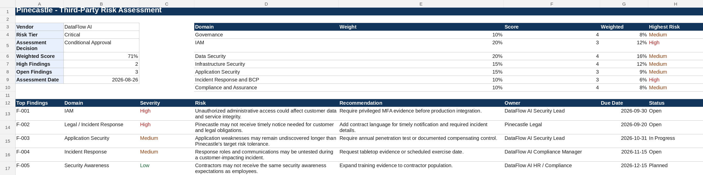

# Project 6 (Pinecastle Phase 3): Third-Party Risk Management Assessment

> **Fictional organization. Created for portfolio demonstration purposes.**

## Purpose

A pre-contract security review of a prospective vendor: a 27-question evidence-based questionnaire, a weighted scorecard, five findings with remediation tracking, and a documented approval recommendation.

## Scenario

Pinecastle Software wants to onboard a fictional SaaS vendor, DataFlow AI, to enrich customer-support analytics. DataFlow AI would process confidential customer business data and integrate with Pinecastle's production application and Salesforce environment.

Because the vendor will process customer data and connect to production workflows, Pinecastle classifies DataFlow AI as a critical third party requiring security review before approval.

## The judgment call

DataFlow AI's two high-severity findings, incomplete privileged-MFA evidence and vague breach-notification terms, were enough that I wasn't comfortable with an unconditional approval. They also weren't disqualifying. The security foundation was reasonable, and both gaps are things a vendor can fix on a timeline. I recommended conditional approval with four named preconditions instead of a rejection. A more risk-averse analyst could reasonably have rejected the vendor outright until every finding closed, given the AI system's access to confidential customer data, and that call would have cost Pinecastle a service leadership already wanted.

## Dashboard preview

## Standards used

- NIST SP 800-161 Rev. 1 Update 1 for cyber supply-chain risk management.
- NIST CSF 2.0 for governance, supply-chain, protection, detection, response, and recovery alignment.
- NIST IR 8286 Rev. 1 series for enterprise-risk escalation and reporting.
- NIST SP 800-53 Rev. 5 Release 5.2.0 for control references.
- NIST SP 800-53A Rev. 5 for evidence and control-assessment logic.
- CIS Controls v8.1 for practical safeguard mapping.
- ISO/IEC 27001:2022/Amd 1:2024 and ISO/IEC 27002:2022 for ISMS and control-language alignment.
- ISO/IEC 27017:2026 for cloud-service security considerations.
- AICPA Trust Services Criteria with revised points of focus 2022 for SOC 2 evidence review.
- NIST SP 800-61 Rev. 3 for incident-response evidence and breach-notification considerations.

## Deliverables

- `Pinecastle-Third-Party-Risk-Assessment.xlsx`
- [Vendor Risk Assessment Report](Pinecastle-DataFlow-AI-Vendor-Risk-Assessment-Report.md)

## Approach

- Classified the vendor as Critical by data access and production integration.
- Scored 27 questions against simulated SOC 2, penetration-test, policy, incident-response, and continuity evidence. Two questions are specific to an AI vendor: whether Pinecastle data trains the vendor's models (it does not; the DPA excludes it), and whether model changes are announced in advance (they are not).
- Recorded the tabletop question as "Unable to test — evidence not provided" because no exercise report was supplied (F-004).
- Separated vendor control gaps from contract gaps, and tracked each finding to a closure criterion.

## Files

| Artifact | Browse | Working file |
|---|---|---|
| Pinecastle Third-Party Risk Assessment | [PDF](pdf/Pinecastle-Third-Party-Risk-Assessment.pdf) | [xlsx](artifacts/Pinecastle-Third-Party-Risk-Assessment.xlsx) |
