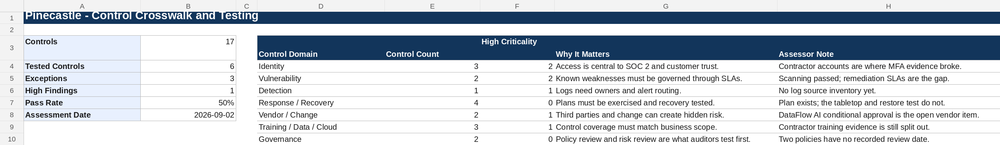

# Project 7 (Pinecastle Phase 4): Control Framework Crosswalk and Control Testing

> **Fictional organization. Created for portfolio demonstration purposes.**

## Purpose

A unified internal control library mapped across NIST, CIS, ISO, and SOC 2, with evidence requests, test workpapers, exceptions, and remediation tracking.

## Scenario

Pinecastle Software is preparing for stronger customer security reviews and SOC 2. Leadership wants one control library instead of separate checklists for NIST, CIS, ISO, and SOC 2.

## The judgment call

The library has 17 controls. Six got test workpapers this cycle: access control got two, change management and vendor review got one each, and business continuity got none. I weighted testing toward access control because Phase 1 scored privileged account compromise at 15, among the highest residual risks, and testing effort should follow risk. Change management was added late so that the one control rated Effective in Phase 1 (R-018) had evidence behind the rating; it passed, 22 of 22 changes. A different analyst aiming for breadth across all eleven control areas could have spread the six slots differently and found problems in areas this cycle did not touch.

## Dashboard preview

## Standards used

- NIST CSF 2.0 for outcome-oriented program structure.
- NIST SP 800-53 Rev. 5 Release 5.2.0 for detailed control references.
- NIST SP 800-53A Rev. 5 for control assessment procedures and evidence logic.
- CIS Controls v8.1 for practical prioritized safeguards.
- ISO/IEC 27001:2022/Amd 1:2024 and ISO/IEC 27002:2022 for ISMS and control guidance.
- ISO/IEC 27017:2026 for cloud-specific controls.
- AICPA Trust Services Criteria with revised points of focus 2022 for SOC 2 readiness language.
- NIST SP 800-61 Rev. 3 for incident-response controls.
- NIST SP 800-161 Rev. 1 Update 1 for vendor and supply-chain controls.

## Deliverables

- `Pinecastle-Control-Framework-Crosswalk-and-Testing.xlsx`
- [Control Crosswalk and Testing Report](Pinecastle-Control-Crosswalk-and-Testing-Report.md)

## Approach

- Wrote each control as a testable statement with an owner, a frequency, and the evidence that would prove it.
- Mapped each control to the frameworks, with a note where the fit is partial (CHG-01 to CIS 4, for example).
- Tested six controls for design and operation: three passed and three had exceptions.
- Recorded the exceptions as findings with root cause and remediation.

## Files

| Artifact | Browse | Working file |
|---|---|---|
| Pinecastle Control Framework Crosswalk and Testing | [PDF](pdf/Pinecastle-Control-Framework-Crosswalk-and-Testing.pdf) | [xlsx](artifacts/Pinecastle-Control-Framework-Crosswalk-and-Testing.xlsx) |
