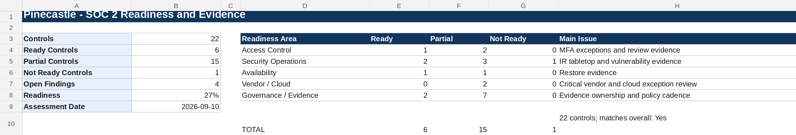

# Project 8 (Pinecastle Phase 5): SOC 2 Readiness and Evidence Management

> **Fictional organization. Created for portfolio demonstration purposes.**

## Purpose

SOC 2 readiness for a company that has not yet engaged an auditor: a 22-control readiness matrix, a 13-item PBC evidence tracker, six audit-style findings with remediation, and a readiness decision for leadership.

## Scenario

Pinecastle Software is not yet undergoing a real SOC 2 examination, but customer security reviews are increasing. Leadership wants to understand what evidence exists, what is missing, where control exceptions exist, and what must be remediated before engaging an auditor.

## The judgment call

Incident Response is the only theme rated Not Ready, worse than every Partial rating elsewhere, but I put MFA exception evidence at the top of the 60-90 day sprint. IR readiness needs an actual tabletop exercise scheduled and run, which takes longer than any evidence-collection task on this list. Sequencing the sprint by severity alone would have opened with the worst-rated theme and produced no closed gap by the deadline. A different analyst could reasonably have led with IR anyway, on the logic that the worst-rated control deserves executive attention first regardless of how long the fix takes.

## Dashboard preview

## Standards used

- AICPA Trust Services Criteria with revised points of focus 2022 for SOC 2 readiness language.
- NIST CSF 2.0 for program structure and risk communication.
- NIST SP 800-53 Rev. 5 Release 5.2.0 and NIST SP 800-53A Rev. 5 for control and evidence testing concepts.
- CIS Controls v8.1 for practical control expectations.
- ISO/IEC 27001:2022/Amd 1:2024 and ISO/IEC 27002:2022 for ISMS control alignment.
- ISO/IEC 27017:2026 for cloud-specific control considerations.
- NIST SP 800-61 Rev. 3 for incident-response readiness.
- NIST SP 800-161 Rev. 1 Update 1 for vendor-control readiness.

## Deliverables

- `Pinecastle-SOC2-Readiness-and-Evidence-Tracker.xlsx`
- [SOC 2 Readiness Report](Pinecastle-SOC2-Readiness-Report.md)

## Approach

- Rated each of 22 controls Ready, Partial, or Not Ready, and grouped them into five readiness areas that add up to the same total.
- Tracked 13 PBC requests with owner, due date, status, and an auditor-style comment. Two are still missing, including the log source inventory that became SOCF-006.
- Wrote each finding with a root cause, a corrective action, and the evidence that would close it.
- Recommended a Type I report first, with the Type II observation window starting only after a readiness retest.

## Files

| Artifact | Browse | Working file |
|---|---|---|
| Pinecastle SOC 2 Readiness and Evidence Tracker | [PDF](pdf/Pinecastle-SOC2-Readiness-and-Evidence-Tracker.pdf) | [xlsx](artifacts/Pinecastle-SOC2-Readiness-and-Evidence-Tracker.xlsx) |
