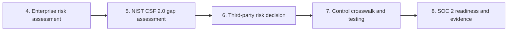
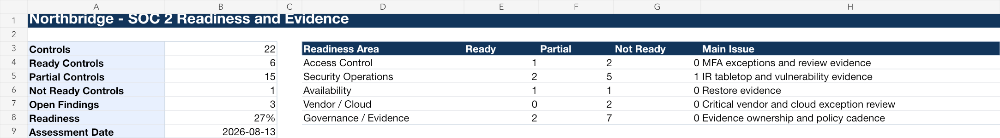

# Cybersecurity Governance, Risk & Compliance Portfolio

**Chris Morrissey** | GRC, cyber risk, control assurance, and federal cloud security

Eight hands-on projects showing how I translate security frameworks into business decisions, testable controls, audit-ready evidence, and owned remediation.

[Portfolio website](https://morrisseyventuresllc.com) · [LinkedIn](https://linkedin.com/in/christophermorrissey88) · [GitHub profile](https://github.com/moski001) · [Five-minute review](#five-minute-review)

> [!IMPORTANT]
> Every organization, system, vendor, assessment result, finding, and incident in this repository is fictional. The work products are original and contain no employer, client, confidential, proprietary, or controlled information. See the [full disclaimer](DISCLAIMER.md).

## Portfolio at a glance

| # | Project | Environment | Evidence of capability |
|---:|---|---|---|
| 1 | [Meridian Health Analytics — GRC Program](01-meridian-health-grc-program/) | Healthcare analytics / HIPAA | 15-risk register, NIST CSF 2.0 gap assessment, multi-framework control mapping, vendor risk, policy, and BIA |
| 2 | [Cascade Civic Systems — FedRAMP Rev5 ATO](02-cascade-civic-rev5-ato/) | Federal grants SaaS | SSP, 30-control traceability matrix, security assessment report, POA&M, shared-responsibility matrix, and IR tabletop AAR |
| 3 | [Northgate Signal — FedRAMP 20x](03-northgate-signal-fedramp-20x/) | Government case-management SaaS | Python validation engine, 12 KSIs, 24 independent validation methods, machine-readable evidence, and two detected drift conditions |
| 4 | [Northbridge — Enterprise Risk Assessment](04-northbridge-cloudworks-grc-program/01-enterprise-risk-assessment/) | B2B cloud SaaS | 20 risks, inherent/residual scoring, control-effectiveness analysis, treatment plans, owners, and executive dashboard |
| 5 | [Northbridge — NIST CSF 2.0 Gap Assessment](04-northbridge-cloudworks-grc-program/02-nist-csf-gap-assessment/) | B2B cloud SaaS | 18 assessed outcomes across all six functions, 12 high-priority gaps, current/target profiles, and a 12-month roadmap |
| 6 | [Northbridge — Third-Party Risk Management](04-northbridge-cloudworks-grc-program/03-third-party-risk-management/) | Critical AI SaaS vendor | 25-question evidence-based assessment, weighted scorecard, five findings, remediation tracking, and conditional-approval decision |
| 7 | [Northbridge — Control Crosswalk & Testing](04-northbridge-cloudworks-grc-program/04-control-framework-crosswalk/) | Multi-framework assurance | 15-control internal library, NIST/CIS/ISO/SOC 2 crosswalk, five test workpapers, exceptions, and corrective actions |
| 8 | [Northbridge — SOC 2 Readiness](04-northbridge-cloudworks-grc-program/05-soc2-readiness/) | Pre-audit readiness | 22-control matrix, PBC evidence tracker, five audit-style findings, remediation plan, and executive readiness decision |
| 9 | [Halcyon Benefits Group](05-halcyon-ai-governance/) | AI governance | Building governance for AI deployed before anyone asked whether it should be |

## Why five fictional companies

The scenarios are deliberately different, because the competencies they exercise are different and no single environment shows all of them.

**Northbridge Cloudworks** (projects 4-8) is a connected commercial program: one company carried from risk identification through to an audit-readiness decision. It shows how a GRC function operates as a system rather than as a set of exercises.

**Meridian Health Analytics** (project 1) adds a regulated-data environment. HIPAA and PHI change what "high impact" means, and the artifacts reflect that.

**Cascade Civic Systems** (project 2) moves into federal authorization, where the process is prescribed and the discipline is traceability: every deficiency traceable from control, to finding, to remediation plan with an owner and a date.

**Northgate Signal** (project 3) is the same federal discipline under the standard that replaced it. FedRAMP published the Consolidated Rules for 2026 in June 2026, replacing narrative control descriptions with Key Security Indicators validated automatically against the running system. This project was built after that change, and demonstrates it rather than describing it.

**Halcyon Benefits Group** (project 9) extends the discipline into AI governance. It applies the same sequence — inventory, classify, assess, map controls, decide — to nine AI systems deployed without oversight, including two that meet the EU AI Act's high-risk definition. Built against a regulatory timeline that moved mid-project.

Read together: commercial program management, regulated industry, federal authorization, continuous compliance engineering, and AI governance.

## What this portfolio demonstrates

| Competency | Demonstrated in |
|---|---|
| Enterprise cyber risk and executive reporting | Projects 1 and 4 |
| NIST CSF 2.0 assessment and remediation roadmapping | Projects 1 and 5 |
| Control design, mapping, testing, and evidence evaluation | Projects 1, 2, 7, and 8 |
| Third-party and supply-chain risk management | Projects 1 and 6 |
| SOC 2 readiness and audit support | Projects 7 and 8 |
| FedRAMP, RMF, SSP/SAR/POA&M, and shared responsibility | Project 2 |
| Continuous compliance, structured evidence, and security automation | Project 3 |
| Policy, business continuity, incident response, and stakeholder communication | Projects 1, 2, 5, and 8 |

## The Northbridge program: five projects, one operating model

[Northbridge Cloudworks](04-northbridge-cloudworks-grc-program/) is a connected program for one fictional 120-person cloud SaaS company. Each phase uses decisions and evidence from the phase before it.

The sequence demonstrates more than framework familiarity: risk drives priorities; priorities drive control design; testing produces findings; findings receive owners and due dates; and evidence quality determines readiness.

## Program evidence preview

The dashboards are rendered directly from the working Excel deliverables: [enterprise risk](assets/dashboard-previews/northbridge-enterprise-risk-dashboard.png) · [NIST CSF 2.0 gaps](assets/dashboard-previews/northbridge-nist-csf-gap-dashboard.png) · [third-party risk](assets/dashboard-previews/northbridge-third-party-risk-dashboard.png) · [control testing](assets/dashboard-previews/northbridge-control-testing-dashboard.png) · [SOC 2 readiness](assets/dashboard-previews/northbridge-soc2-readiness-dashboard.png)

## Five-minute review

If you are a recruiter or hiring manager, these three items show the range of the portfolio quickly:

1. [Northbridge SOC 2 Readiness Report](04-northbridge-cloudworks-grc-program/05-soc2-readiness/Northbridge-SOC2-Readiness-Report.md) — executive communication, audit judgment, and remediation priorities.
2. [Cascade Security Assessment Report](02-cascade-civic-rev5-ato/pdf/security_assessment_report.pdf) — assessment writing and defensible finding structure; start with `FIND-001`.
3. [Northgate KSI Validator](03-northgate-signal-fedramp-20x/src/ksi_validator.py) — automation, machine-readable evidence, and the distinction between declared configuration and observed behavior.

For a commercial-risk sample, open the [Meridian Risk Register PDF](01-meridian-health-grc-program/pdf/risk_register.pdf) or the [Northbridge Enterprise Risk Assessment PDF](04-northbridge-cloudworks-grc-program/01-enterprise-risk-assessment/pdf/Northbridge-Enterprise-Risk-Assessment.pdf). Every workbook is published twice: a PDF in each project's `pdf/` folder that previews directly in the browser, and the working `.xlsx` in `artifacts/` with live formulas, dashboards, and conditional logic intact.

## Artifact design

- **Browser-ready evidence:** Markdown reports and PDF exports make the work reviewable without specialized software.
- **Working deliverables:** Excel workbooks retain scoring formulas, dashboards, conditional logic, trackers, and workpapers; Word files retain editable document structure.
- **Traceability:** risks, controls, findings, owners, evidence, and remediation actions connect across related artifacts.
- **Honest conclusions:** failed tests, open findings, conditional approvals, and incomplete readiness remain visible instead of being optimized away for presentation.
- **Machine-readable security:** the FedRAMP 20x project includes Python and JSON alongside human-readable reporting.

## Frameworks and standards applied

[NIST CSF 2.0](https://www.nist.gov/cyberframework) · NIST SP 800-30 Rev. 1 · NIST IR 8286 Rev. 1 series · NIST SP 1308 · NIST SP 800-53 / 800-53A Rev. 5 · NIST SP 800-37 Rev. 2 · NIST SP 800-61 Rev. 3 · NIST SP 800-161 Rev. 1 Update 1 · FIPS 199 · [FedRAMP Rev5](https://www.fedramp.gov/legacy/) · [FedRAMP Consolidated Rules for 2026 / 20x](https://www.fedramp.gov/2026/) · CIS Controls v8.1 · ISO/IEC 27001:2022/Amd 1:2024 · ISO/IEC 27002:2022 · [ISO/IEC 27017:2026](https://www.iso.org/standard/27017) · AICPA Trust Services Criteria · HIPAA/HITECH · NIST AI RMF 1.0 · NIST AI 600-1 · ISO/IEC 42001:2023 · EU AI Act · NYC Local Law 144

Standards change. Each project states its scope and limitations; current authoritative sources should always be checked before using any artifact in a real program. The FedRAMP 20x JSON is modeled on the Consolidated Rules for 2026 and is not represented as schema-validated certification data.

## About me

I build GRC work that connects technical evidence to decisions leaders can act on. My background includes CompTIA A+, Network+, Security+, and Project+; CompTIA CIOS and CSIS stacked credentials; ITIL Foundation v4; and coursework toward Cisco AI Technical Practitioner.

I am interested in opportunities including **GRC Analyst, Cyber Risk Analyst, Third-Party Risk Analyst, IT Auditor, ISSO, Security Control Assessor, and IT Specialist (INFOSEC)**.

## Contact

[morrisseyventuresllc.com](https://morrisseyventuresllc.com) · [LinkedIn](https://linkedin.com/in/christophermorrissey88) · [github.com/moski001](https://github.com/moski001)

---

This repository is a demonstration portfolio, not legal, regulatory, audit, or certification advice.
