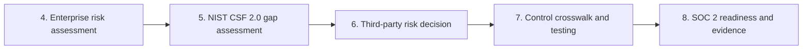

# Cybersecurity Governance, Risk & Compliance Portfolio

**Chris Morrissey** | GRC, cyber risk, control assurance, privacy, and federal cloud security

Ten projects that turn security frameworks into business decisions, testable controls, audit-ready evidence, and remediation with named owners.

[Portfolio website](https://morrisseyventuresllc.com) · [LinkedIn](https://linkedin.com/in/christophermorrissey88) · [GitHub profile](https://github.com/moski001) · [Five-minute review](#five-minute-review)

> [!IMPORTANT]
> Every organization, system, vendor, assessment result, finding, and incident in this repository is fictional, created for portfolio demonstration purposes. The work products are original and contain no employer, client, confidential, proprietary, or controlled information. See the [full disclaimer](DISCLAIMER.md).

## Portfolio at a glance

| # | Project | Environment | What it contains |
|---:|---|---|---|
| 1 | [Tavares Claims Services: GRC Program](01-tavares-claims-grc-program/) | Healthcare claims / HIPAA | 17-risk register with a formal risk acceptance record, CSF 2.0 gap assessment across all 22 Categories, 21-control mapping, vendor risk, policy, and BIA |
| 2 | [Tailspin Civic Systems: FedRAMP Rev5 ATO](02-tailspin-civic-rev5-ato/) | Federal grants SaaS | SSP, 33-control traceability matrix, security assessment report, POA&M, customer responsibility matrix, and IR tabletop AAR |
| 3 | [Salgado Public Systems: FedRAMP 20x](03-salgado-public-fedramp-20x/) | Government case-management SaaS | Python validation engine, 13 KSIs, 26 independent validation methods, hash-verifiable machine-readable evidence, two detected drift conditions, and an [interactive results dashboard](https://claude.ai/artifact/7DrT2VsqkTfA3HZH695FQ3) |
| 4 | [Pinecastle: Enterprise Risk Assessment](04-pinecastle-software-grc-program/01-enterprise-risk-assessment/) | B2B cloud SaaS | 22 risks, inherent/residual scoring, control-effectiveness ratings, treatment plans, owners, and executive dashboard |
| 5 | [Pinecastle: NIST CSF 2.0 Gap Assessment](04-pinecastle-software-grc-program/02-nist-csf-gap-assessment/) | B2B cloud SaaS | 18 assessed outcomes across all six Functions, current/target profiles, and a roadmap sequenced by dependency |
| 6 | [Pinecastle: Third-Party Risk Management](04-pinecastle-software-grc-program/03-third-party-risk-management/) | Critical AI SaaS vendor | 27-question evidence-based assessment, weighted scorecard, five findings, remediation tracking, and a conditional approval |
| 7 | [Pinecastle: Control Crosswalk & Testing](04-pinecastle-software-grc-program/04-control-framework-crosswalk/) | Multi-framework assurance | 17-control internal library, NIST/CIS/ISO/SOC 2 crosswalk, six test workpapers, exceptions, and corrective actions |
| 8 | [Pinecastle: SOC 2 Readiness](04-pinecastle-software-grc-program/05-soc2-readiness/) | Pre-audit readiness | 22-control matrix, 13-item PBC tracker, six audit-style findings, remediation plan, and readiness decision |
| 9 | [Rockledge Benefits Administrators: AI Governance](05-rockledge-benefits-ai-governance/) | Employee benefits / AI systems | 8-system AI inventory plus a shadow-AI finding, EU AI Act tiering, 13 risks mapped to NIST AI RMF characteristics, a 16-objective crosswalk across AI RMF/ISO 42001/EU AI Act, and a decision memo |
| 10 | [Pineda Salon Co.: Biometric Privacy Assessment](06-pineda-salon-biometric-dpia/) | Multi-state retail / AI biometric capture | DPIA across Texas CUBI, HB 149 (TRAIGA), TDPSA, Florida Digital Bill of Rights, and FTC § 5; five findings, a superseded risk acceptance, and no-cost remediations that close most of the exposure |

## Why six fictional companies

Each scenario exercises something the others do not.

**Pinecastle Software** (projects 4-8) is a connected commercial program: one company followed from risk identification to an audit-readiness decision, with each phase using the results of the last.

**Tavares Claims Services** (project 1) adds regulated data. HIPAA and PHI change what "high impact" means, and the artifacts reflect that.

**Tailspin Civic Systems** (project 2) moves into federal authorization, where the process is prescribed and the work is traceability: every deficiency traced from control, to finding, to a remediation plan with an owner and a date.

**Salgado Public Systems** (project 3) applies the federal work under the newer rules. FedRAMP published the Consolidated Rules for 2026 in June 2026, replacing narrative control descriptions with Key Security Indicators validated automatically against the running system, and this project implements that in code.

**Rockledge Benefits Administrators** (project 9) takes the same sequence (inventory, classify, assess, map controls, decide) into AI governance: eight AI systems deployed without oversight plus one shadow-AI finding, one system clearly high-risk under Annex III and one whose classification is contested. The EU's Digital Omnibus entered into force partway through, deferring some obligations and not others.

**Pineda Salon Co.** (project 10) brings the work into state privacy law and ordinary retail. Nine salons in two states installed AI skin-diagnostic kiosks bought as marketing equipment, which put face-geometry capture and a third-party AI vendor inside a business with no privacy function. The applicability analysis is most of the work: HIPAA does not attach despite the health-adjacent data, the Florida Digital Bill of Rights reaches a small business through one provision, and Texas CUBI as amended by HB 149 both narrows and extends what the vendor and the salon each owe.

## What this portfolio covers

| Competency | Projects |
|---|---|
| Enterprise cyber risk and executive reporting | 1 and 4 |
| NIST CSF 2.0 assessment and remediation roadmapping | 1 and 5 |
| Control design, mapping, testing, and evidence evaluation | 1, 2, 7, and 8 |
| Third-party and supply-chain risk management | 1, 6, and 10 |
| SOC 2 readiness and audit support | 7 and 8 |
| FedRAMP, RMF, SSP/SAR/POA&M, and shared responsibility | 2 |
| Continuous compliance, structured evidence, and security automation | 3 |
| Policy, business continuity, incident response, and stakeholder communication | 1, 2, 5, and 8 |
| AI governance, EU AI Act classification, and AI risk assessment | 9 and 10 |
| State privacy and biometric law (CUBI, TDPSA, FDBR) and privacy impact assessment | 10 |

## The Pinecastle program

[Pinecastle Software](04-pinecastle-software-grc-program/) is one fictional cloud SaaS company of about 120 people, and each phase uses decisions and evidence from the phase before it.

```mermaid
flowchart LR
    A["4. Enterprise risk assessment"] --> B["5. NIST CSF 2.0 gap assessment"]
    B --> C["6. Third-party risk decision"]
    C --> D["7. Control crosswalk and testing"]
    D --> E["8. SOC 2 readiness and evidence"]
```

Risk sets the priorities, the priorities decide which controls get tested, testing produces findings with owners and due dates, and the quality of the evidence decides readiness.

## Program evidence preview

Each preview is rendered from the Dashboard sheet of the working Excel file: [enterprise risk](assets/dashboard-previews/pinecastle-enterprise-risk-dashboard.png) · [NIST CSF 2.0 gaps](assets/dashboard-previews/pinecastle-nist-csf-gap-dashboard.png) · [third-party risk](assets/dashboard-previews/pinecastle-third-party-risk-dashboard.png) · [control testing](assets/dashboard-previews/pinecastle-control-testing-dashboard.png) · [SOC 2 readiness](assets/dashboard-previews/pinecastle-soc2-readiness-dashboard.png)

## Five-minute review

For a recruiter or hiring manager, these five items cover the range quickly:

1. [Pinecastle SOC 2 Readiness Report](04-pinecastle-software-grc-program/05-soc2-readiness/Pinecastle-SOC2-Readiness-Report.md): executive communication, audit judgment, and remediation priorities.
2. [Tailspin Security Assessment Report](02-tailspin-civic-rev5-ato/pdf/security_assessment_report.pdf): assessment writing and finding structure; start with `FIND-001`.
3. [Salgado KSI Validator](03-salgado-public-fedramp-20x/src/ksi_validator.py): automation, machine-readable evidence, and the difference between declared configuration and observed behavior. The [results dashboard](https://claude.ai/artifact/7DrT2VsqkTfA3HZH695FQ3) shows the same evidence visually.
4. [Rockledge AI Governance Decision Memo](05-rockledge-benefits-ai-governance/pdf/ai_governance_decision_memo.pdf): emerging regulation, a contested classification left open for counsel, and a reversible executive recommendation.
5. [Pineda SkinRead DPIA](06-pineda-salon-biometric-dpia/pdf/skinread_dpia.pdf): state privacy applicability, a risk acceptance the assessor declined to support, and remediation that cost nothing.

For a commercial-risk sample, open the [Tavares Risk Register PDF](01-tavares-claims-grc-program/pdf/risk_register.pdf) or the [Pinecastle Enterprise Risk Assessment PDF](04-pinecastle-software-grc-program/01-enterprise-risk-assessment/pdf/Pinecastle-Enterprise-Risk-Assessment.pdf). Every workbook is published twice: a PDF in the project's `pdf/` folder that previews in the browser, and the working `.xlsx` in `artifacts/` with live formulas and conditional formatting.

## How the artifacts are built

- **Readable without special software:** Markdown reports and PDF exports.
- **Working files:** Excel workbooks keep scoring formulas, dashboards, trackers, and workpapers; Word files keep editable structure.
- **Cross-references:** risks, controls, findings, owners, evidence, and remediation actions link across related artifacts.
- **Unresolved items stay in:** failed tests, open findings, disputed ratings, conditional approvals, and incomplete readiness are reported as they stand.
- **Machine-readable security:** the FedRAMP 20x project includes Python and JSON alongside the human-readable reports.

## Frameworks and standards applied

[NIST CSF 2.0](https://www.nist.gov/cyberframework) · NIST SP 800-30 Rev. 1 · NIST IR 8286 Rev. 1 series · NIST SP 1308 · NIST SP 800-53 / 800-53A Rev. 5 · NIST SP 800-37 Rev. 2 · NIST SP 800-61 Rev. 3 · NIST SP 800-161 Rev. 1 Update 1 · FIPS 199 · [FedRAMP Rev5](https://www.fedramp.gov/legacy/) · [FedRAMP Consolidated Rules for 2026 / 20x](https://www.fedramp.gov/2026/) · CIS Controls v8.1 · ISO/IEC 27001:2022/Amd 1:2024 · ISO/IEC 27002:2022 · [ISO/IEC 27017:2026](https://www.iso.org/standard/27017) · AICPA Trust Services Criteria · PCI DSS v4.0.1 · HIPAA/HITECH · NIST AI RMF 1.0 · NIST AI 600-1 · ISO/IEC 42001:2023 · EU AI Act · NYC Local Law 144 · Texas Capture or Use of Biometric Identifier Act (Tex. Bus. & Com. Code § 503.001) · Texas Responsible AI Governance Act (HB 149) · Texas Data Privacy and Security Act · Florida Digital Bill of Rights · FTC Act § 5 and FTC Policy Statement on Biometric Information (2023)

Standards change. Each project states its scope and limitations, and current authoritative sources should be checked before any artifact is used in a real program. The FedRAMP 20x JSON is modeled on the Consolidated Rules for 2026 and is not presented as schema-validated certification data.

## About me

I build GRC work that connects technical evidence to decisions leaders can act on. My background includes CompTIA A+, Network+, Security+, and Project+; CompTIA CIOS and CSIS stacked credentials; ITIL Foundation v4; and coursework toward Cisco AI Technical Practitioner.

I am interested in roles including **GRC Analyst, Cyber Risk Analyst, Third-Party Risk Analyst, Privacy Analyst, IT Auditor, ISSO, Security Control Assessor, and IT Specialist (INFOSEC)**.

## Contact

[morrisseyventuresllc.com](https://morrisseyventuresllc.com) · [LinkedIn](https://linkedin.com/in/christophermorrissey88) · [github.com/moski001](https://github.com/moski001)

---

This repository is a demonstration portfolio, not legal, regulatory, audit, or certification advice.
