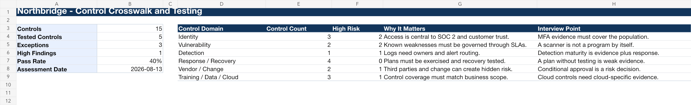

# Project 4 - Control Framework Crosswalk and Control Testing

## Purpose

This project demonstrates how a GRC analyst can translate multiple frameworks into a practical internal control library, map controls across standards, request evidence, perform control testing, document exceptions, and track remediation.

## Scenario

Northbridge Cloudworks is preparing for stronger customer security reviews and future SOC 2 readiness work. Leadership wants a unified control library instead of separate, duplicated checklists for NIST, CIS, ISO, and SOC 2.

## Dashboard Preview

## Standards Used

- NIST CSF 2.0 for outcome-oriented program structure.
- NIST SP 800-53 Rev. 5 Release 5.2.0 for detailed control references.
- NIST SP 800-53A Rev. 5 for control assessment procedures and evidence logic.
- CIS Controls v8.1 for practical prioritized safeguards.
- ISO/IEC 27001:2022/Amd 1:2024 and ISO/IEC 27002:2022 for ISMS and control guidance.
- ISO/IEC 27017:2026 for cloud-specific controls.
- AICPA Trust Services Criteria with revised points of focus 2022 for SOC 2 readiness language.
- NIST SP 800-61 Rev. 3 for incident-response controls.
- NIST SP 800-161 Rev. 1 Update 1 for vendor and supply-chain controls.

## Deliverables

- `Northbridge-Control-Framework-Crosswalk-and-Testing.xlsx`
- [Control Crosswalk and Testing Report](Northbridge-Control-Crosswalk-and-Testing-Report.md)
- [Project 4 Learning Guide](Project-4-Learning-Guide.md)
- [Project 4 Interview Discussion Guide](Project-4-Interview-Discussion-Guide.md)

## What This Proves

This project shows that you can:

- Build an internal control library.
- Map one internal control to multiple frameworks.
- Distinguish framework mapping from actual control testing.
- Request evidence that supports a control objective.
- Evaluate design and operating effectiveness.
- Document exceptions and remediation actions.
- Explain control work in language auditors and managers understand.

## Suggested Interview Positioning

> I built a unified control library and framework crosswalk for a fictional SaaS company. Instead of treating NIST, CIS, ISO, and SOC 2 as separate checklists, I mapped practical internal controls to multiple external requirements and then created test workpapers for selected controls. That helped demonstrate how one well-designed control can support several compliance obligations.
